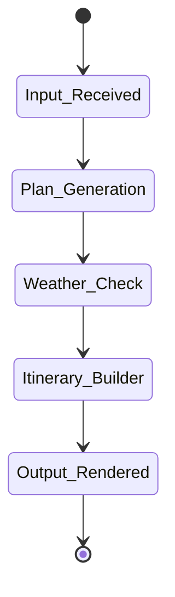

# 🌍 Atriyos – AI Travel Planner

Atriyos is a smart, modular AI-powered travel planning system that generates optimized, environment-aware itineraries based on user preferences.

Built with:
- 🐍 Modular Python Architecture  
- ⚡ Fast backend with **Uvicorn** (ASGI server)  
- 📊 System flow modeled using **MermaidChart.com** & **UV-based state diagrams**  
- 🖼️ Beautiful, interactive UI using **Streamlit**

---

## 🎯 Features

- Accepts custom travel inputs (e.g., location, duration, interests)
- Matches preferences with curated destination logic
- Checks weather/environmental context
- Builds structured day-wise itineraries
- Full-stack: Clean backend + UI in one repo

---

## 🧠 Architecture

##  Folder Structure

atriyos-travel-planner/
├── main.py                 # ASGI entrypoint (uvicorn)
├── ui.py                   # Streamlit UI
├── planner/
│   ├── __init__.py
│   ├── input_handler.py
│   ├── planner.py
│   ├── weather_service.py
│   └── utils.py
├── data/                   # Destination & weather data
├── requirements.txt
└── README.md

# uv pip list
# to run the server : streamlit run AI_TRIPPLANNER\streamlit_app.py

# For Server :- 
# first change to the cd W:\Youtube_langraph1\AI_TRIPPLANNER
# then:-
# "uvicorn main:app --host 0.0.0.0 --port 8000 --reload" run this after changing to this path W:\Youtube_langraph1\AI_TRIPPLANNER
# for running streamlitt app :- " streamlit run streamlit_app.py "
